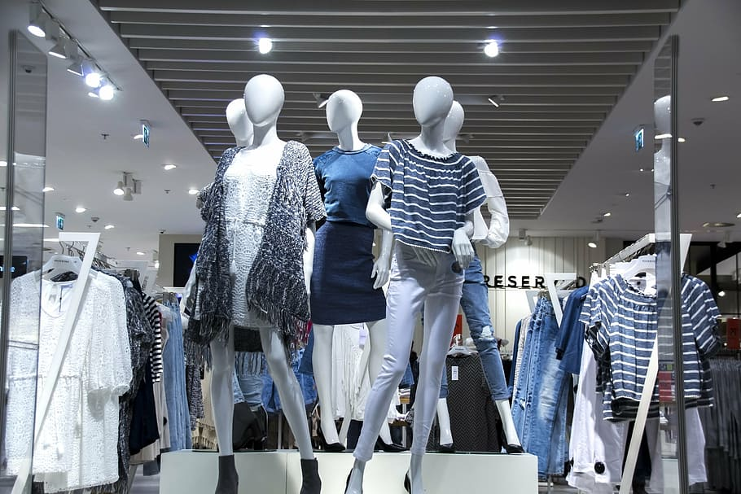
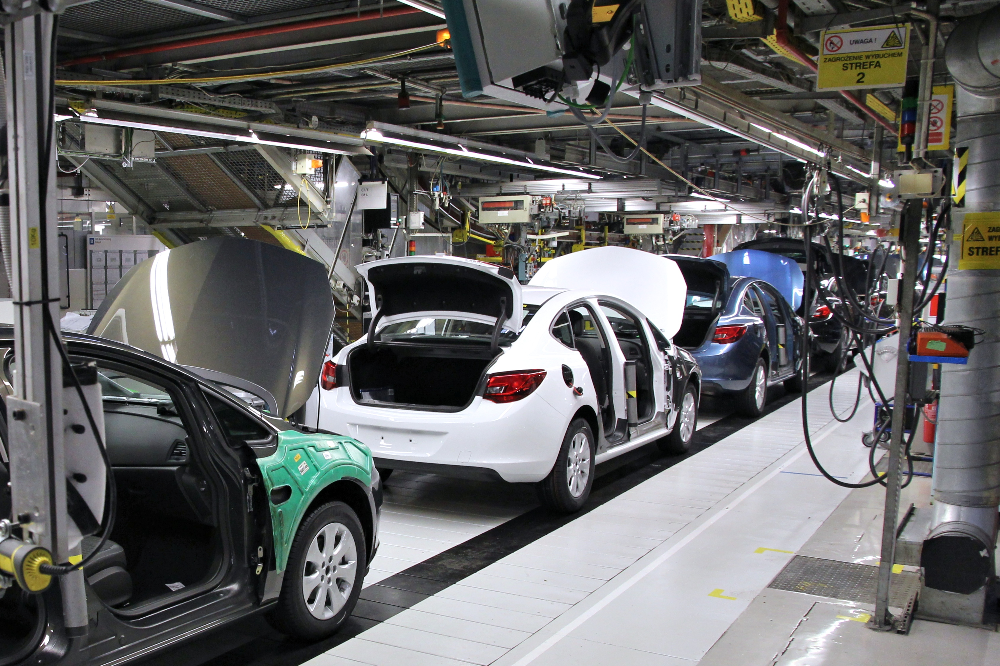

### Project Overview

#### 1. **Purpose and Scope**
The project aims to provide a comprehensive visualization and data representation of online sales across different categories. It includes features for displaying detailed sales data, visual charts for data analysis, and information about the team behind the project.

#### Project Structure
```
project-root/
├── index.html
├── home.html
├── data.html
├── team.html
└── image/
    ├── back.jpg
    ├── data.jpg
    ├── team.jpg
    ├── img2.jpeg
    ├── Elec.jpg
    ├── fash.jpg
    ├── home.jfif
    ├── bea.jfif
    ├── sports.jpg
    └── auto.jpg
```


#### 2. **Main Features**
- **Homepage (index.html)**
  - Introduction to the project titled "Data Science And Visualization (21CS644)".
  - Navigation sidebar with links to different sections: Project, Dataset, and Team Members.
  - Displays the course title and information about the project guide, Victor Agughasi Ikechuwu, from the Dept. of CS&E, MIT, Mysore.

- **Project Page (home.html)**
  - Title: "Online Sales Data".
  - Overview of different product categories: Electronics, Fashion, Home & Kitchen, Beauty & Health, Sports & Outdoors, Automotive.
  - Dynamic chart rendering using Chart.js, allowing users to view data in various chart types (bar, line, pie, doughnut, radar, polar area).
  - Contains sample images for each category and detailed guidance information.
  - Background image enhances visual appeal.

- **Dataset Page (data.html)**
  - Title: "Datasets".
  - Detailed table displaying monthly sales data for various product categories:
    - Electronics
    - Fashion
    - Home & Kitchen
    - Beauty & Health
    - Sports & Outdoors
    - Automotive
  - Provides a structured view of sales data to facilitate easy analysis and comparison.

- **Team Page (team.html)**
  - Title: "Team Members".
  - Lists the names and USNs of the team members involved in the project.
  - Background image and styled heading to highlight team details.

#### 3. **Technologies Used**
- **HTML & CSS:** For structuring and styling the web pages.
- **Bootstrap:** For responsive design and additional styling elements.
- **JavaScript:** For interactivity, including the sidebar functionality and chart rendering.
- **Chart.js:** For creating various types of charts to visualize sales data.

#### 4. **Visual Elements**
- **Background Images:** Each page has a unique background image relevant to its content, enhancing the visual experience.
- **Charts and Tables:** Provide a clear and interactive way to present and analyze data.
- **Navigation Sidebar:** Ensures easy access to different sections of the project.

Sure, here's the revised installation guide without the directory structure section:

### Prerequisites
- **Web Browser:** Any modern web browser (e.g., Chrome, Firefox, Safari, Edge).
- **Web Server:** Optional, but recommended for running the HTML files. You can use simple servers like `http-server` (Node.js) or any other lightweight server.

### Steps to Install and Run the Project

1. **Download the Project Files**
   - Ensure you have all the HTML files (`index.html`, `home.html`, `data.html`, `team.html`) and the `image` folder with the necessary images.

2. **Running the Project**
   - **Option 1: Open Directly in a Browser**
     - Navigate to the project directory.
     - Open `index.html` with your web browser by double-clicking the file or right-clicking and selecting "Open with" and choosing your browser.

   - **Option 2: Using a Local Web Server**
     - **Using Python HTTP Server**
       - Open a terminal or command prompt.
       - Navigate to the project directory.
       - Run the following command to start a simple HTTP server:
         ```sh
         python -m http.server
         ```
       - Open your web browser and go to `http://localhost:8000/index.html`.

     - **Using `http-server` (Node.js)**
       - Install `http-server` if you haven't already:
         ```sh
         npm install -g http-server
         ```
       - Navigate to the project directory.
       - Run the server:
         ```sh
         http-server
         ```
       - Open your web browser and go to `http://localhost:8080/index.html`.
      
   Sure, here is an explanation of the code for each of the provided HTML files:

### 1. `index.html`

This file serves as the main page with navigation to other parts of the project.

#### HTML Structure:
```html
<!DOCTYPE html>
<html lang="en">
<head>
  <title>Data Science And Visualization (21CS644)</title>
  <meta charset="utf-8">
  <meta name="viewport" content="width=device-width, initial-scale=1">
  <link href="https://cdn.jsdelivr.net/npm/bootstrap@5.3.3/dist/css/bootstrap.min.css" rel="stylesheet">
  <script src="https://cdn.jsdelivr.net/npm/bootstrap@5.3.3/dist/js/bootstrap.bundle.min.js"></script>
  <style>
    body {
      font-family: Arial, sans-serif;
      background-image: url(image/img2.jpeg);
      background-repeat: no-repeat;
      background-size: cover;
    }
    .sidenav {
      height: 100%;
      width: 0;
      position: fixed;
      z-index: 1;
      top: 0;
      left: 0;
      background-color: #111;
      overflow-x: hidden;
      transition: 0.5s;
      padding-top: 60px;
    }
    .sidenav a {
      padding: 8px 8px 8px 32px;
      text-decoration: none;
      font-size: 25px;
      color: #818181;
      display: block;
      transition: 0.3s;
    }
    .sidenav a:hover {
      color: #f1f1f1;
    }
    .sidenav .closebtn {
      position: absolute;
      top: 0;
      right: 25px;
      font-size: 36px;
      margin-left: 50px;
    }
    h2 {
      color: white;
    }
  </style>
</head>
<body>
  <div id="mySidenav" class="sidenav">
    <a href="javascript:void(0)" class="closebtn" onclick="closeNav()">&times;</a>
    <a href="home.html">Project</a>
    <a href="data.html">Dataset</a>
    <a href="team.html">Team Members</a>
  </div>
  <span style="font-size:30px;cursor:pointer" onclick="openNav()">&#9776; open</span>
  <div style="margin-left: 100px;">
    <h2>Data Science And Visualization (21CS644)</h2>
    <p style="color: white; font-size: 24px;">Manoj S 4MH21CS048</p>
    <p style="color: white; font-size: 24px;">Abhishek P 4MH21CS400</p>
    <p style="color: white; font-size: 24px;">Basavaraju B K 4MH21CS009</p>
    <p style="color: white; font-size: 24px;">Suhas R 4MH21CS104</p>
    <p style="color: yellow; font-size: 24px;">Under The Guidance Of:<br>Victor Agughasi Ikechuwu<br>Dept. of CS&E, MIT, Mysore</p>
  </div>
  <script>
    function openNav() {
      document.getElementById("mySidenav").style.width = "250px";
    }
    function closeNav() {
      document.getElementById("mySidenav").style.width = "0";
    }
  </script>
</body>
</html>
```

#### Key Elements:
- **CSS and Bootstrap**: Used for styling and responsiveness.
- **Sidebar Navigation**: Implemented with a sidenav that opens and closes via JavaScript functions.
- **Content**: Includes the project title, team member names, and guidance information.

### 2. `home.html`

This file displays an overview of the sales data categories and a dynamic chart.

#### HTML Structure:
```html
<!DOCTYPE html>
<html lang="en">
<head>
  <meta charset="UTF-8">
  <meta name="viewport" content="width=device-width, initial-scale=1.0">
  <title>Online Sales Data</title>
  <script src="https://cdn.jsdelivr.net/npm/chart.js"></script>
  <style>
    body {
      font-family: Arial, sans-serif;
      margin: 20px;
      background-image: url(image/back.jpg);
      background-repeat: no-repeat;
      background-size: cover;
    }
    canvas {
      margin: 20px auto;
      display: block;
      background-color: lightgray;
    }
    .nav {
      background-color: #cccc00;
      color: red;
      padding: 10px;
      cursor: pointer;
      width: 100px;
      height: 100px;
      text-align: center;
    }
    h1, label {
      color: white;
    }
    .row::after {
      content: "";
      clear: both;
      display: table;
    }
    img {
      border: 7px solid blueviolet;
    }
  </style>
</head>
<body>
  <center><h1>Online Sales Data</h1></center>
  <h2 style="color: white;">*Electronics* *Fashion* *Home & Kitchen* *Beauty & Health* *Sports & Outdoors* *Automotive*</h2>
  <div class="row">
    
    
    
    
    
    
  </div>
  <div style="margin-left: 1000px; color: aqua;">
    Under The Guidance Of:<br><br><b>Victor Agughasi Ikechuwu</b><p>Dept. of CS&E, MIT, Mysore</p>
  </div>
  <label for="chartType">Select Chart Type:</label>
  <select id="chartType" aria-label="Chart Type Selector" onchange="updateChart()">
    <option value="bar">Bar</option>
    <option value="line">Line</option>
    <option value="pie">Pie</option>
    <option value="doughnut">Doughnut</option>
    <option value="radar">Radar</option>
    <option value="polarArea">Polar Area</option>
  </select>
  <canvas id="myChart" aria-label="Chart Display" width="400" height="400"></canvas>
  <script>
    const ctx = document.getElementById('myChart').getContext('2d');
    const data = {
      labels: ['January', 'February', 'March', 'April', 'May', 'June'],
      datasets: [
        { label: 'Electronics', data: [100, 120, 150, 130, 170, 160], backgroundColor: 'rgba(255, 99, 132, 0.2)', borderColor: 'rgba(255, 99, 132, 1)', borderWidth: 1 },
        { label: 'Fashion', data: [90, 100, 110, 120, 130, 140], backgroundColor: 'rgba(54, 162, 235, 0.2)', borderColor: 'rgba(54, 162, 235, 1)', borderWidth: 1 },
        { label: 'Home & Kitchen', data: [80, 85, 90, 95, 100, 105], backgroundColor: 'rgba(255, 206, 86, 0.2)', borderColor: 'rgba(255, 206, 86, 1)', borderWidth: 1 },
        { label: 'Beauty & Health', data: [70, 75, 80, 85, 90, 95], backgroundColor: 'rgba(75, 192, 192, 0.2)', borderColor: 'rgba(75, 192, 192, 1)', borderWidth: 1 },
        { label: 'Sports & Outdoors', data: [60, 65, 70, 75, 80, 85], backgroundColor: 'rgba(153, 102, 255, 0.2)', borderColor: 'rgba(153, 102, 255, 1)', borderWidth: 1 },
        { label: 'Automotive', data: [50, 55, 60, 65, 70, 75], backgroundColor: 'rgba(255, 159, 64, 0.2)', borderColor: 'rgba(255, 159, 64, 1)', borderWidth: 1 }
      ]
    };

    let chart = new Chart(ctx, {
      type: 'bar',
      data: data,
      options: { scales: { y: { beginAtZero: true } } }
    });

    function updateChart() {
      const chartType = document.getElementById('chartType').value;
      chart.destroy();


      chart = new Chart(ctx, {
        type: chartType,
        data: data,
        options: { scales: { y: { beginAtZero: true } } }
      });
    }
  </script>
</body>
</html>
```

#### Key Elements:
- **Chart.js**: Used for creating dynamic charts to visualize sales data.
- **Dropdown Menu**: Allows users to select different types of charts.
- **Images**: Displayed for each product category.
- **JavaScript**: Handles chart rendering and updating based on user selection.

### 3. `data.html`

This file displays the sales data in a tabular format.

#### HTML Structure:
```html
<!DOCTYPE html>
<html lang="en">
<head>
  <meta charset="UTF-8">
  <meta name="viewport" content="width=device-width, initial-scale=1.0">
  <title>Datasets</title>
  <style>
    body {
      font-family: Arial, sans-serif;
      margin: 20px;
      background-image: url(image/data.jpg);
      background-repeat: no-repeat;
      background-size: cover;
    }
    table {
      width: 100%;
      border-collapse: collapse;
      background-color: #f9f9f9;
    }
    table, th, td {
      border: 1px solid black;
    }
    th, td {
      padding: 15px;
      text-align: left;
    }
    th {
      background-color: #4CAF50;
      color: white;
    }
    h1 {
      color: white;
    }
  </style>
</head>
<body>
  <h1>Datasets</h1>
  <table>
    <tr>
      <th>Category</th>
      <th>January</th>
      <th>February</th>
      <th>March</th>
      <th>April</th>
      <th>May</th>
      <th>June</th>
    </tr>
    <tr>
      <td>Electronics</td>
      <td>100</td>
      <td>120</td>
      <td>150</td>
      <td>130</td>
      <td>170</td>
      <td>160</td>
    </tr>
    <tr>
      <td>Fashion</td>
      <td>90</td>
      <td>100</td>
      <td>110</td>
      <td>120</td>
      <td>130</td>
      <td>140</td>
    </tr>
    <tr>
      <td>Home & Kitchen</td>
      <td>80</td>
      <td>85</td>
      <td>90</td>
      <td>95</td>
      <td>100</td>
      <td>105</td>
    </tr>
    <tr>
      <td>Beauty & Health</td>
      <td>70</td>
      <td>75</td>
      <td>80</td>
      <td>85</td>
      <td>90</td>
      <td>95</td>
    </tr>
    <tr>
      <td>Sports & Outdoors</td>
      <td>60</td>
      <td>65</td>
      <td>70</td>
      <td>75</td>
      <td>80</td>
      <td>85</td>
    </tr>
    <tr>
      <td>Automotive</td>
      <td>50</td>
      <td>55</td>
      <td>60</td>
      <td>65</td>
      <td>70</td>
      <td>75</td>
    </tr>
  </table>
</body>
</html>
```

#### Key Elements:
- **Table**: Used to display the sales data for different categories and months.
- **Styling**: Includes styles for the table and page background.

### 4. `team.html`

This file lists the team members involved in the project.

#### HTML Structure:
```html
<!DOCTYPE html>
<html lang="en">
<head>
  <meta charset="UTF-8">
  <meta name="viewport" content="width=device-width, initial-scale=1.0">
  <title>Team</title>
  <style>
    body {
      font-family: Arial, sans-serif;
      margin: 20px;
      background-image: url(image/team.jpg);
      background-repeat: no-repeat;
      background-size: cover;
    }
    table {
      width: 100%;
      border-collapse: collapse;
      background-color: #f9f9f9;
    }
    table, th, td {
      border: 1px solid black;
    }
    th, td {
      padding: 15px;
      text-align: left;
    }
    th {
      background-color: #4CAF50;
      color: white;
    }
    h1 {
      color: white;
    }
  </style>
</head>
<body>
  <h1>Team Members</h1>
  <table>
    <tr>
      <th>Name</th>
      <th>USN</th>
    </tr>
    <tr>
      <td>Manoj S</td>
      <td>4MH21CS048</td>
    </tr>
    <tr>
      <td>Abhishek P</td>
      <td>4MH21CS400</td>
    </tr>
    <tr>
      <td>Basavaraju B K</td>
      <td>4MH21CS009</td>
    </tr>
    <tr>
      <td>Suhas R</td>
      <td>4MH21CS104</td>
    </tr>
  </table>
</body>
</html>
```

#### Key Elements:
- **Table**: Lists the names and USNs of the team members.
- **Styling**: Includes styles for the table and page background.

#### Supervised by 
[Prof. Agughasi Victor Ikechukwu](https://github.com/Victor-Ikechukwu), 
(Assistant Professor) 
Department of CSE, MIT Mysore)

####  **Team Information**
  - Manoj S (USN: 4MH21CS048)(https://github.com/ManojManuS)
  - Abhishek P (USN: 4MH21CS400)(https://github.com/Abhishek8021)
  - Basavaraju B K (USN: 4MH21CS009)(https://github.com/basavarajubk666)
  - Suhas R (USN: 4MH21CS104)(https://github.com/suhasrgowda)

#### Screenshots


### Conclusion
This project effectively combines data science and visualization techniques to present online sales data in an accessible and visually appealing manner. It leverages modern web technologies to create an interactive and informative platform for data analysis and presentation.
